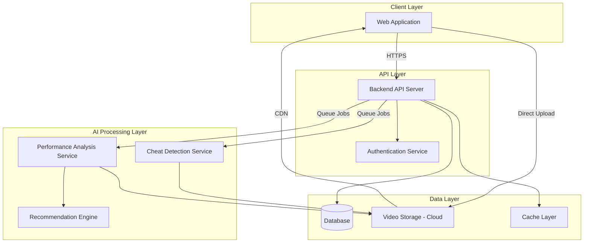

# Design Document: Sports Talent Recognition Platform

## Overview

The Sports Talent Recognition Platform is a web-based application that connects athletes with government talent scouts through video-based performance showcasing and AI-powered analysis. The system consists of a frontend web application, a backend API server, an AI analysis pipeline, and cloud storage for videos. Athletes can upload videos in two modes: private (for AI feedback only) or public (direct recording for scout viewing). The AI system performs cheat detection on file uploads, analyzes performance, and recommends training resources.

The platform is designed for a 4-day MVP build, focusing on core athlete and government scout workflows with gamification elements to drive engagement.

## Architecture

### High-Level Architecture



### Technology Stack Recommendations

**Frontend:**
- React or Next.js for web application
- WebRTC for direct video recording
- Video.js or similar for video playback
- TailwindCSS for gamified UI design

**Backend:**
- Node.js/Express or Python/FastAPI for API server
- PostgreSQL for relational data (profiles, metadata)
- Redis for caching and session management
- JWT for authentication tokens

**AI/ML:**
- Python-based AI services
- OpenCV for video processing
- Pre-trained models for action recognition (e.g., I3D, SlowFast)
- Deepfake detection models (e.g., FaceForensics++, EfficientNet-based)
- YouTube Data API for video recommendations

**Infrastructure:**
- Cloud storage (AWS S3, Google Cloud Storage, or Azure Blob)
- CDN for video delivery
- Message queue (RabbitMQ, AWS SQS) for async AI processing
- Docker containers for service deployment

## Components and Interfaces

### 1. Web Application (Frontend)

**Responsibilities:**
- Athlete profile creation and management UI
- Video recording interface using WebRTC
- File upload interface with drag-and-drop
- Video playback with analysis overlays
- Government scout discovery and search interface
- Gamification elements (badges, progress bars, leaderboards)

**Key Interfaces:**

```typescript
// Athlete Profile Interface
interface AthleteProfile {
  id: string;
  name: string;
  age: number;
  sport: string;
  location: string;
  bio: string;
  profileImage: string;
  createdAt: Date;
  updatedAt: Date;
}

// Video Upload Interface
interface VideoUpload {
  mode: 'private' | 'public';
  type: 'direct_recording' | 'file_upload';
  file?: File;
  metadata: {
    sport: string;
    testType?: string; // For benchmark tests
    description: string;
  };
}

// Video Metadata Interface
interface VideoMetadata {
  id: string;
  athleteId: string;
  uploadMode: 'private' | 'public';
  uploadType: 'direct_recording' | 'file_upload';
  sport: string;
  testType?: string;
  storageUrl: string;
  thumbnailUrl: string;
  duration: number;
  status: 'processing' | 'ready' | 'failed';
  cheatDetectionResult?: CheatDetectionResult;
  performanceAnalysis?: PerformanceAnalysis;
  uploadedAt: Date;
}
```

### 2. Backend API Server

**Responsibilities:**
- RESTful API endpoints for all platform operations
- Authentication and authorization
- Video upload coordination
- Database operations
- AI job queue management
- Caching frequently accessed data

**Key API Endpoints:**

```
Authentication:
POST   /api/auth/register          - Register new user
POST   /api/auth/login             - Login user
POST   /api/auth/logout            - Logout user
GET    /api/auth/me                - Get current user

Athlete Profiles:
POST   /api/athletes/profile       - Create athlete profile
GET    /api/athletes/profile/:id   - Get athlete profile
PUT    /api/athletes/profile/:id   - Update athlete profile
GET    /api/athletes/search        - Search athletes (scouts only)

Videos:
POST   /api/videos/upload          - Initiate video upload
GET    /api/videos/:id             - Get video metadata
GET    /api/videos/athlete/:id     - Get athlete's videos
DELETE /api/videos/:id             - Delete video
POST   /api/videos/:id/publish     - Transition private to public

AI Analysis:
GET    /api/analysis/:videoId      - Get analysis results
GET    /api/recommendations/:videoId - Get video recommendations

Benchmarking:
GET    /api/benchmarks/:sport      - Get national standards
GET    /api/benchmarks/compare/:videoId - Get benchmark comparison

Gamification:
GET    /api/achievements/:athleteId - Get athlete achievements
GET    /api/leaderboard/:sport     - Get sport leaderboard
```

**Authentication Service Interface:**

```typescript
interface AuthService {
  register(userData: UserRegistration): Promise<User>;
  login(credentials: LoginCredentials): Promise<AuthToken>;
  verifyToken(token: string): Promise<User>;
  logout(token: string): Promise<void>;
}

interface UserRegistration {
  email: string;
  password: string;
  role: 'athlete' | 'scout';
  name: string;
}

interface AuthToken {
  accessToken: string;
  refreshToken: string;
  expiresIn: number;
}
```

### 3. Video Storage Service

**Responsibilities:**
- Store uploaded videos in cloud storage
- Generate signed URLs for secure access
- Manage video lifecycle (upload, retrieval, deletion)
- Generate thumbnails
- Provide CDN-backed streaming

**Interface:**

```typescript
interface VideoStorageService {
  uploadVideo(file: Buffer, metadata: VideoMetadata): Promise<StorageResult>;
  getVideoUrl(videoId: string, expiresIn: number): Promise<string>;
  deleteVideo(videoId: string): Promise<void>;
  generateThumbnail(videoId: string): Promise<string>;
}

interface StorageResult {
  videoId: string;
  storageUrl: string;
  thumbnailUrl: string;
  size: number;
}
```

### 4. AI Cheat Detection Service

**Responsibilities:**
- Analyze uploaded videos for tampering
- Detect video editing, speed manipulation, deepfakes
- Provide confidence scores
- Flag suspicious videos

**Approach:**
- **Frame-level analysis**: Extract frames and check for inconsistencies
- **Temporal analysis**: Detect unnatural speed changes or frame drops
- **Deepfake detection**: Use pre-trained models to detect face manipulation
- **Metadata analysis**: Check video file metadata for editing software signatures
- **Compression artifacts**: Analyze compression patterns for re-encoding signs

**Interface:**

```typescript
interface CheatDetectionService {
  analyzeVideo(videoId: string): Promise<CheatDetectionResult>;
}

interface CheatDetectionResult {
  videoId: string;
  isAuthentic: boolean;
  confidenceScore: number; // 0-1
  detectedIssues: CheatIssue[];
  analyzedAt: Date;
}

interface CheatIssue {
  type: 'editing' | 'speed_manipulation' | 'deepfake' | 'metadata_tampering';
  severity: 'low' | 'medium' | 'high';
  description: string;
  timestamp?: number; // Location in video where issue detected
}
```

**Implementation Notes:**
- For MVP, use lightweight models (EfficientNet-based deepfake detection)
- Focus on obvious tampering (speed changes, cuts, metadata)
- Queue-based processing to handle async workload
- Store results in database for quick retrieval

### 5. Performance Analysis Service

**Responsibilities:**
- Analyze athlete technique in videos
- Identify specific movements and form issues
- Generate actionable feedback
- Extract performance metrics for benchmarking

**Approach:**
- **Pose estimation**: Use models like OpenPose or MediaPipe to track body keypoints
- **Action recognition**: Identify specific movements (e.g., sprint start, jump technique)
- **Form analysis**: Compare athlete's form against ideal technique templates
- **Metric extraction**: Calculate speed, height, distance, angles from video

**Interface:**

```typescript
interface PerformanceAnalysisService {
  analyzePerformance(videoId: string, sport: string): Promise<PerformanceAnalysis>;
}

interface PerformanceAnalysis {
  videoId: string;
  sport: string;
  overallScore: number; // 0-100
  strengths: string[];
  weaknesses: Weakness[];
  metrics: PerformanceMetric[];
  analyzedAt: Date;
}

interface Weakness {
  area: string; // e.g., "Sprint start technique"
  description: string;
  severity: 'minor' | 'moderate' | 'major';
  improvementTips: string[];
}

interface PerformanceMetric {
  name: string; // e.g., "Sprint time", "Jump height"
  value: number;
  unit: string;
  percentile?: number; // Compared to national standards
}
```

**Implementation Notes:**
- Use MediaPipe for pose estimation (lightweight, fast)
- Sport-specific analysis modules (start with 2-3 common sports for MVP)
- Rule-based form analysis for MVP (ML models for future)
- Cache analysis results to avoid reprocessing

### 6. Recommendation Engine

**Responsibilities:**
- Generate relevant YouTube video recommendations
- Match recommendations to identified weaknesses
- Provide context for why videos are recommended

**Approach:**
- Use YouTube Data API to search for training videos
- Match search queries to weakness keywords
- Filter by view count and relevance
- Cache popular recommendations

**Interface:**

```typescript
interface RecommendationEngine {
  generateRecommendations(weaknesses: Weakness[], sport: string): Promise<VideoRecommendation[]>;
}

interface VideoRecommendation {
  title: string;
  youtubeUrl: string;
  thumbnailUrl: string;
  channelName: string;
  viewCount: number;
  relevanceReason: string; // Why this video is recommended
  addressesWeakness: string; // Which weakness it helps with
}
```

### 7. Benchmarking Service

**Responsibilities:**
- Store national performance standards
- Compare athlete metrics against standards
- Calculate percentile rankings
- Support multiple sports and age groups

**Interface:**

```typescript
interface BenchmarkingService {
  compareToStandards(metrics: PerformanceMetric[], sport: string, age: number): Promise<BenchmarkComparison>;
  getStandards(sport: string, age: number): Promise<PerformanceStandard[]>;
}

interface BenchmarkComparison {
  athleteMetrics: PerformanceMetric[];
  comparisons: MetricComparison[];
  overallPercentile: number;
}

interface MetricComparison {
  metricName: string;
  athleteValue: number;
  nationalAverage: number;
  nationalTop10: number;
  percentile: number;
  rating: 'below_average' | 'average' | 'above_average' | 'excellent';
}

interface PerformanceStandard {
  sport: string;
  ageGroup: string;
  metricName: string;
  average: number;
  top10Percentile: number;
  top25Percentile: number;
  unit: string;
}
```

### 8. Gamification Service

**Responsibilities:**
- Track athlete achievements and milestones
- Award badges and points
- Maintain leaderboards
- Calculate progress metrics

**Interface:**

```typescript
interface GamificationService {
  awardAchievement(athleteId: string, achievementType: string): Promise<Achievement>;
  getAchievements(athleteId: string): Promise<Achievement[]>;
  updateLeaderboard(sport: string, athleteId: string, score: number): Promise<void>;
  getLeaderboard(sport: string, limit: number): Promise<LeaderboardEntry[]>;
}

interface Achievement {
  id: string;
  athleteId: string;
  type: string; // e.g., "first_video", "10_videos", "top_10_percentile"
  title: string;
  description: string;
  badgeIcon: string;
  points: number;
  unlockedAt: Date;
}

interface LeaderboardEntry {
  rank: number;
  athleteId: string;
  athleteName: string;
  sport: string;
  score: number;
  profileImage: string;
}
```

## Data Models

### Database Schema

```sql
-- Users table (both athletes and scouts)
CREATE TABLE users (
  id UUID PRIMARY KEY DEFAULT gen_random_uuid(),
  email VARCHAR(255) UNIQUE NOT NULL,
  password_hash VARCHAR(255) NOT NULL,
  role VARCHAR(20) NOT NULL CHECK (role IN ('athlete', 'scout')),
  name VARCHAR(255) NOT NULL,
  created_at TIMESTAMP DEFAULT NOW(),
  updated_at TIMESTAMP DEFAULT NOW()
);

-- Athlete profiles
CREATE TABLE athlete_profiles (
  id UUID PRIMARY KEY DEFAULT gen_random_uuid(),
  user_id UUID REFERENCES users(id) ON DELETE CASCADE,
  age INTEGER,
  sport VARCHAR(100),
  location VARCHAR(255),
  bio TEXT,
  profile_image_url VARCHAR(500),
  total_points INTEGER DEFAULT 0,
  created_at TIMESTAMP DEFAULT NOW(),
  updated_at TIMESTAMP DEFAULT NOW()
);

-- Videos
CREATE TABLE videos (
  id UUID PRIMARY KEY DEFAULT gen_random_uuid(),
  athlete_id UUID REFERENCES athlete_profiles(id) ON DELETE CASCADE,
  upload_mode VARCHAR(20) NOT NULL CHECK (upload_mode IN ('private', 'public')),
  upload_type VARCHAR(30) NOT NULL CHECK (upload_type IN ('direct_recording', 'file_upload')),
  sport VARCHAR(100) NOT NULL,
  test_type VARCHAR(100),
  storage_url VARCHAR(500) NOT NULL,
  thumbnail_url VARCHAR(500),
  duration INTEGER, -- in seconds
  status VARCHAR(20) DEFAULT 'processing' CHECK (status IN ('processing', 'ready', 'failed')),
  description TEXT,
  uploaded_at TIMESTAMP DEFAULT NOW()
);

-- Cheat detection results
CREATE TABLE cheat_detection_results (
  id UUID PRIMARY KEY DEFAULT gen_random_uuid(),
  video_id UUID REFERENCES videos(id) ON DELETE CASCADE,
  is_authentic BOOLEAN NOT NULL,
  confidence_score DECIMAL(3,2) NOT NULL,
  detected_issues JSONB,
  analyzed_at TIMESTAMP DEFAULT NOW()
);

-- Performance analysis results
CREATE TABLE performance_analyses (
  id UUID PRIMARY KEY DEFAULT gen_random_uuid(),
  video_id UUID REFERENCES videos(id) ON DELETE CASCADE,
  sport VARCHAR(100) NOT NULL,
  overall_score INTEGER,
  strengths JSONB,
  weaknesses JSONB,
  metrics JSONB,
  analyzed_at TIMESTAMP DEFAULT NOW()
);

-- Video recommendations
CREATE TABLE video_recommendations (
  id UUID PRIMARY KEY DEFAULT gen_random_uuid(),
  analysis_id UUID REFERENCES performance_analyses(id) ON DELETE CASCADE,
  title VARCHAR(255) NOT NULL,
  youtube_url VARCHAR(500) NOT NULL,
  thumbnail_url VARCHAR(500),
  channel_name VARCHAR(255),
  view_count INTEGER,
  relevance_reason TEXT,
  addresses_weakness VARCHAR(255)
);

-- National performance standards
CREATE TABLE performance_standards (
  id UUID PRIMARY KEY DEFAULT gen_random_uuid(),
  sport VARCHAR(100) NOT NULL,
  age_group VARCHAR(50) NOT NULL,
  metric_name VARCHAR(100) NOT NULL,
  average_value DECIMAL(10,2) NOT NULL,
  top10_percentile DECIMAL(10,2) NOT NULL,
  top25_percentile DECIMAL(10,2) NOT NULL,
  unit VARCHAR(50) NOT NULL,
  UNIQUE(sport, age_group, metric_name)
);

-- Achievements
CREATE TABLE achievements (
  id UUID PRIMARY KEY DEFAULT gen_random_uuid(),
  athlete_id UUID REFERENCES athlete_profiles(id) ON DELETE CASCADE,
  achievement_type VARCHAR(100) NOT NULL,
  title VARCHAR(255) NOT NULL,
  description TEXT,
  badge_icon VARCHAR(500),
  points INTEGER DEFAULT 0,
  unlocked_at TIMESTAMP DEFAULT NOW()
);

-- Leaderboards
CREATE TABLE leaderboard_entries (
  id UUID PRIMARY KEY DEFAULT gen_random_uuid(),
  sport VARCHAR(100) NOT NULL,
  athlete_id UUID REFERENCES athlete_profiles(id) ON DELETE CASCADE,
  score DECIMAL(10,2) NOT NULL,
  updated_at TIMESTAMP DEFAULT NOW(),
  UNIQUE(sport, athlete_id)
);

-- Scout bookmarks
CREATE TABLE scout_bookmarks (
  id UUID PRIMARY KEY DEFAULT gen_random_uuid(),
  scout_id UUID REFERENCES users(id) ON DELETE CASCADE,
  athlete_id UUID REFERENCES athlete_profiles(id) ON DELETE CASCADE,
  notes TEXT,
  created_at TIMESTAMP DEFAULT NOW(),
  UNIQUE(scout_id, athlete_id)
);

-- Indexes for performance
CREATE INDEX idx_videos_athlete_id ON videos(athlete_id);
CREATE INDEX idx_videos_upload_mode ON videos(upload_mode);
CREATE INDEX idx_athlete_profiles_sport ON athlete_profiles(sport);
CREATE INDEX idx_leaderboard_sport_score ON leaderboard_entries(sport, score DESC);
```

## Correctness Properties

*A property is a characteristic or behavior that should hold true across all valid executions of a system—essentially, a formal statement about what the system should do. Properties serve as the bridge between human-readable specifications and machine-verifiable correctness guarantees.*


### Property 1: Profile Data Round-Trip Persistence

*For any* athlete profile with valid data, creating the profile and then retrieving it should return equivalent profile data with all fields preserved.

**Validates: Requirements 1.2, 1.4**

### Property 2: Profile Update Consistency

*For any* existing athlete profile and any valid field updates, updating the profile should result in the new values being persisted and retrievable.

**Validates: Requirements 1.3**

### Property 3: Direct Recording Public Mode Enforcement

*For any* video uploaded via direct recording, the upload mode should automatically be set to 'public' and the video should be immutable (no edits allowed).

**Validates: Requirements 2.3, 2.4**

### Property 4: Video Format Acceptance

*For any* common video format (MP4, MOV, AVI, WebM), the platform should accept the file upload without format-related errors.

**Validates: Requirements 3.2**

### Property 5: Cheat Detection Execution on File Uploads

*For any* video uploaded via file upload, the AI cheat detection system should be triggered and produce a cheat detection result with a confidence score between 0 and 1.

**Validates: Requirements 3.3, 4.1, 4.5**

### Property 6: Tampered Video Rejection

*For any* video that fails cheat detection (is_authentic = false), the platform should reject the video, prevent it from being used for benchmarking or public display, and notify the athlete.

**Validates: Requirements 3.4, 4.3, 4.4**

### Property 7: Valid Video Storage

*For any* video that passes cheat detection or is directly recorded, the platform should store the video in cloud storage and generate a unique identifier.

**Validates: Requirements 3.5, 11.1, 11.2**

### Property 8: Performance Analysis Trigger for Private Videos

*For any* video uploaded in private mode, the AI performance analysis system should analyze the video and generate feedback including weaknesses and actionable recommendations.

**Validates: Requirements 5.1, 5.3, 5.5**

### Property 9: Video Recommendations Generation

*For any* performance analysis that identifies weaknesses, the recommendation engine should generate at least one YouTube video recommendation with a title, URL, and relevance explanation that addresses the identified weakness.

**Validates: Requirements 6.1, 6.2, 6.3, 6.4, 6.5**

### Property 10: Benchmark Metric Extraction and Comparison

*For any* benchmark test video, the AI system should extract performance metrics and compare them against national standards, producing a percentile ranking for each metric.

**Validates: Requirements 7.2, 7.3, 7.5**

### Property 11: Private Video Access Control

*For any* video in private mode, government scouts should be unable to view or access the video, while the owning athlete should have full access.

**Validates: Requirements 8.2, 8.3**

### Property 12: Public Video Visibility

*For any* video in public mode (including all direct recordings), government scouts should be able to view and access the video.

**Validates: Requirements 2.5, 8.4, 9.5**

### Property 13: Private to Public Transition

*For any* video initially in private mode, an athlete should be able to transition it to public mode, after which it becomes visible to government scouts.

**Validates: Requirements 8.5**

### Property 14: Scout Search and Filter Functionality

*For any* search query with filters (sport, location, age group, performance metrics), the platform should return only athletes matching all specified criteria, including their public videos and performance data.

**Validates: Requirements 9.2, 9.3**

### Property 15: Scout Bookmark Persistence

*For any* athlete bookmarked by a scout, the bookmark should be stored persistently and retrievable in the scout's bookmark list.

**Validates: Requirements 9.4**

### Property 16: Achievement Award on Milestone

*For any* athlete who reaches a defined milestone (e.g., first video upload, score improvement), the platform should award the corresponding achievement badge and points.

**Validates: Requirements 10.2**

### Property 17: Leaderboard Ranking Accuracy

*For any* sport leaderboard, athletes should be ranked in descending order by their score, with the highest score at rank 1.

**Validates: Requirements 10.5**

### Property 18: Video History Completeness

*For any* athlete, retrieving their video history should return all videos they have uploaded, regardless of mode or status.

**Validates: Requirements 11.3**

### Property 19: Video Deletion Cascade

*For any* video deleted by an athlete, the video file, metadata, cheat detection results, performance analysis, and recommendations should all be removed from the system.

**Validates: Requirements 11.5**

### Property 20: Authentication Requirement Enforcement

*For any* protected API endpoint, requests without valid authentication tokens should be rejected with an unauthorized error.

**Validates: Requirements 12.1**

### Property 21: Session Creation on Successful Login

*For any* user with valid credentials, logging in should create a secure session with an access token and refresh token.

**Validates: Requirements 12.3**

### Property 22: Role-Based Access Control

*For any* role-specific feature (athlete profile editing, scout search), only users with the appropriate role should be able to access the feature, while users with other roles should be denied access.

**Validates: Requirements 12.4, 12.5**

## Error Handling

### Video Upload Errors

**Scenarios:**
- File too large (> 500MB for MVP)
- Unsupported video format
- Network interruption during upload
- Storage service unavailable

**Handling:**
- Return clear error messages to the user
- For network interruptions, support resumable uploads (future enhancement)
- Log errors for monitoring
- Provide retry mechanisms for transient failures

### AI Processing Errors

**Scenarios:**
- Cheat detection service timeout
- Performance analysis failure (e.g., no person detected in video)
- Recommendation API rate limit exceeded

**Handling:**
- Queue failed jobs for retry (max 3 attempts)
- Mark videos with processing errors with status 'failed'
- Notify athletes of processing failures
- Provide fallback: allow manual review for cheat detection failures

### Authentication Errors

**Scenarios:**
- Invalid credentials
- Expired tokens
- Insufficient permissions

**Handling:**
- Return appropriate HTTP status codes (401, 403)
- Clear error messages without exposing security details
- Automatic token refresh for expired access tokens
- Redirect to login for unauthenticated requests

### Data Validation Errors

**Scenarios:**
- Invalid profile data (e.g., negative age)
- Missing required fields
- Invalid video metadata

**Handling:**
- Validate all inputs on both client and server
- Return detailed validation errors
- Prevent invalid data from reaching the database

## Testing Strategy

### Dual Testing Approach

The platform will use both unit testing and property-based testing to ensure comprehensive coverage:

**Unit Tests:**
- Specific examples demonstrating correct behavior
- Edge cases (e.g., empty profile fields, zero-length videos)
- Error conditions (e.g., invalid credentials, missing data)
- Integration points between components

**Property-Based Tests:**
- Universal properties that hold for all inputs
- Comprehensive input coverage through randomization
- Validation of correctness properties defined above

### Property-Based Testing Configuration

**Library Selection:**
- **JavaScript/TypeScript**: Use `fast-check` library
- **Python**: Use `hypothesis` library

**Test Configuration:**
- Minimum 100 iterations per property test
- Each property test must reference its design document property
- Tag format: `Feature: sports-talent-platform, Property {number}: {property_text}`

**Example Property Test Structure (TypeScript with fast-check):**

```typescript
// Feature: sports-talent-platform, Property 1: Profile Data Round-Trip Persistence
test('profile data persists correctly after creation', async () => {
  await fc.assert(
    fc.asyncProperty(
      arbitraryAthleteProfile(),
      async (profileData) => {
        const created = await createProfile(profileData);
        const retrieved = await getProfile(created.id);
        
        expect(retrieved.name).toBe(profileData.name);
        expect(retrieved.age).toBe(profileData.age);
        expect(retrieved.sport).toBe(profileData.sport);
        // ... verify all fields
      }
    ),
    { numRuns: 100 }
  );
});
```

### Testing Priorities for 4-Day MVP

**Day 1-2: Core Functionality**
- Authentication and authorization (Properties 20, 21, 22)
- Profile CRUD operations (Properties 1, 2)
- Video upload and storage (Properties 3, 7)

**Day 3: AI Integration**
- Cheat detection (Properties 5, 6)
- Performance analysis (Property 8)
- Basic recommendations (Property 9)

**Day 4: Access Control & Polish**
- Private/public mode (Properties 11, 12, 13)
- Scout features (Properties 14, 15)
- Gamification basics (Properties 16, 17)

### Test Coverage Goals

- Unit test coverage: 70%+ for critical paths
- Property tests: All 22 properties implemented
- Integration tests: Key user flows (athlete upload, scout discovery)
- E2E tests: Happy path for both athlete and scout journeys

### Continuous Testing

- Run unit tests on every commit
- Run property tests in CI/CD pipeline
- Monitor test execution time (property tests may be slower)
- Fail builds on test failures

## Implementation Notes for 4-Day MVP

### Day 1: Foundation
- Set up project structure and database
- Implement authentication system
- Create basic athlete profile CRUD
- Set up video storage integration

### Day 2: Video Upload
- Implement direct recording with WebRTC
- Implement file upload with progress tracking
- Set up AI job queue
- Basic video playback

### Day 3: AI Integration
- Integrate cheat detection (use lightweight model or rule-based for MVP)
- Implement basic performance analysis (pose estimation)
- Set up YouTube API for recommendations
- Create benchmarking comparison logic

### Day 4: Scout Features & Polish
- Implement scout discovery interface
- Add search and filtering
- Implement private/public mode switching
- Add basic gamification (badges, leaderboard)
- UI polish and testing

### Simplifications for MVP

1. **AI Models**: Use lightweight pre-trained models or rule-based approaches
2. **Sports Coverage**: Start with 2-3 common sports (e.g., track & field, basketball)
3. **Benchmarking**: Use simplified/mock national standards data
4. **Gamification**: Basic badges and single leaderboard
5. **Video Processing**: Async processing acceptable (no real-time requirement)

### Future Enhancements (Post-MVP)

- Coach login and multi-athlete management
- Advanced AI models for better analysis
- Real-time video processing
- Mobile app (React Native)
- Social features (athlete connections, comments)
- Payment integration for premium features
- Advanced analytics dashboard for scouts
- Video editing tools for athletes
- Live streaming capabilities
